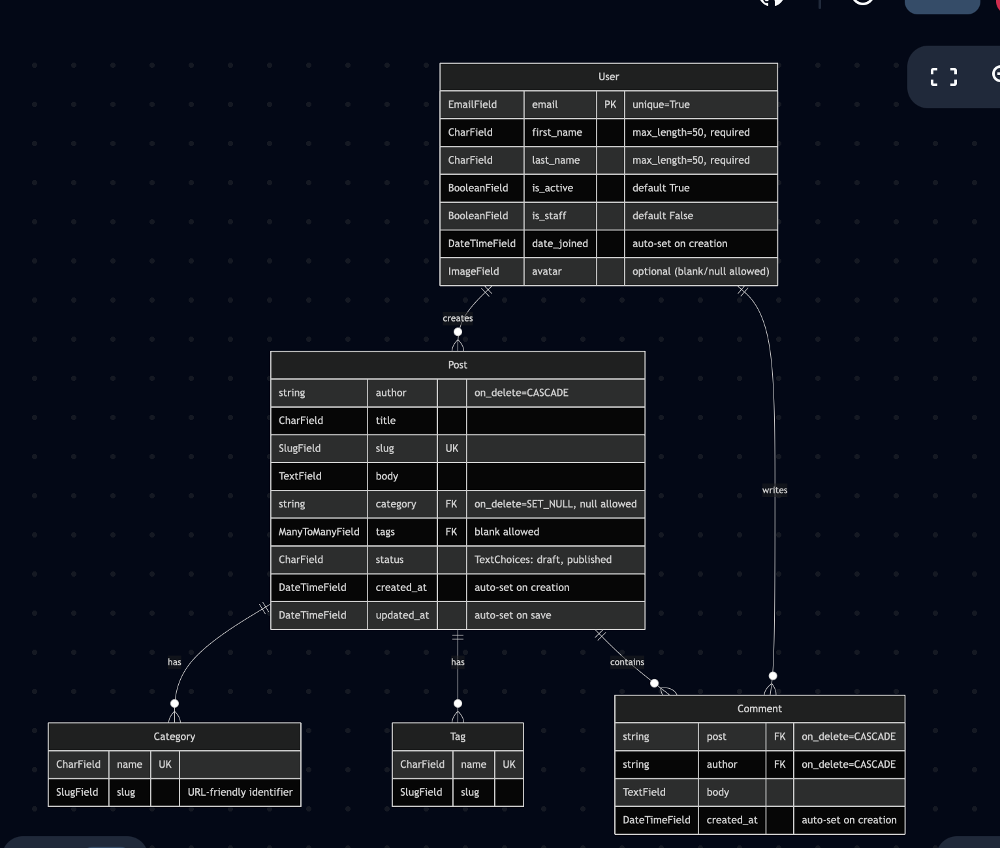

Мы использовали SSE в HW3 так как он подходил лучше для задачи - обновление по постам в real time. (когда кто то выкладывал пост)

SSE более простой в имплементации, кода писать меньше, он работает на основе обычного http

У нас не заложена коллаборация в создании поста, поэтому WebSocket излишен

HTTP polling легкий в настройке, хорошо работает с нечастыми обновлениями 
Минус в том, что клиент видит обновы только со следующим поллом, серверная нагрузка растет с более частыми поллами. Когда малые задержки 
нормальны -> используем HTTP polling, если критично то сокеты или SSE